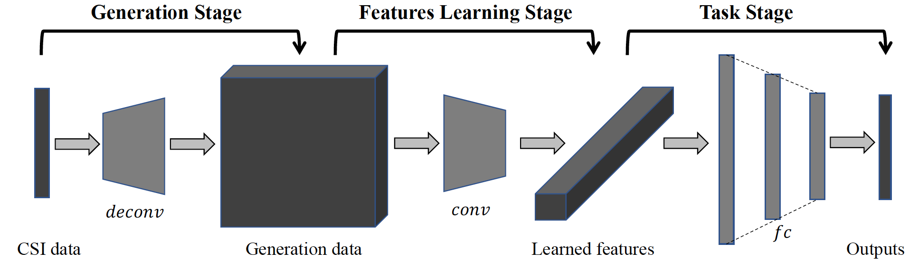

# CSI-Net pytorch

This code can achieve multi-channel, time-serial signal classification  as well as regression by modifying modern backbone networks. In our original paper, we have achieved four human sensing tasks with WiFi signals.
 
We also applied this code with little modification to do motor fault diagnosis in engineering industry. Paper has been submitted to the Transactions on Industrial Electronics with title of *Multi-scale Residual Learning for End-to-end Motor Fault Diagnosis Under Nonstationary Conditions* [Code is here](https://github.com/geekfeiw/Multi-Scale-1D-ResNet). We are designing a light-weighted version for sensing tasks with COTS RFID (under progress). We believe this generic deep networks can solve more sensory data tasks. 

## Tested Environment
1. python 3.6
2. pytorch 0.4.1
3. cuda 8.0/9.0
4. cudnn 6.0/7.3
5. Windows7/Ubuntu16.04

## Usage
1. clone repository.
2. make a directory, name it *weights*, then download pre-trained model into *weights*: *https://drive.google.com/open?id=16HOqFagtigjGry5asx-ErradnWS5rfe2*

We used model, *model/res_net_use_this.py*, to jointly solve two body characterization tasks. Besides, we provide *model/solo_task_res_net.py* for solo classification tasks. 

For various task/data complexity, we also provide multiple mainstream backbones, including Inception V3, V4, VGG, AlexNet. 

## Citation
Please cite this paper in your publications if it helps your research.

    @article{wang2018csi,
      title={CSI-Net: Unified Body Characterization and Action Recognition},
      author={Wang, Fei and Han, Jinsong and Zhang, Shiyuan and He, Xu and Huang, Dong},
      journal={arXiv preprint arXiv:1810.03064},
      year={2018}
    }

